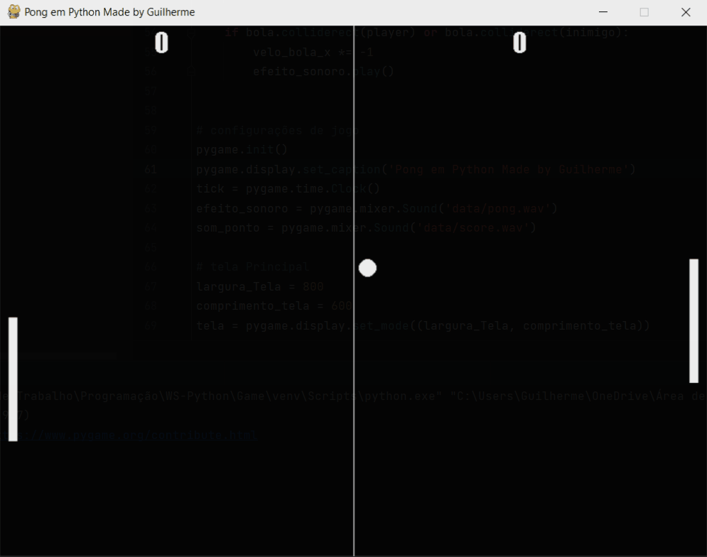

<h1>Jogo Pong em Python  </h1>

---

Esse Projeto Tem Finalidade de Colocar em Pratica Meus conhecimentos de Logica de Programaçao e a Linguagem Python

---

<h2>gameplay</h2>

<h3>tecnologias usadas</h3>

* python3 
* pygame

